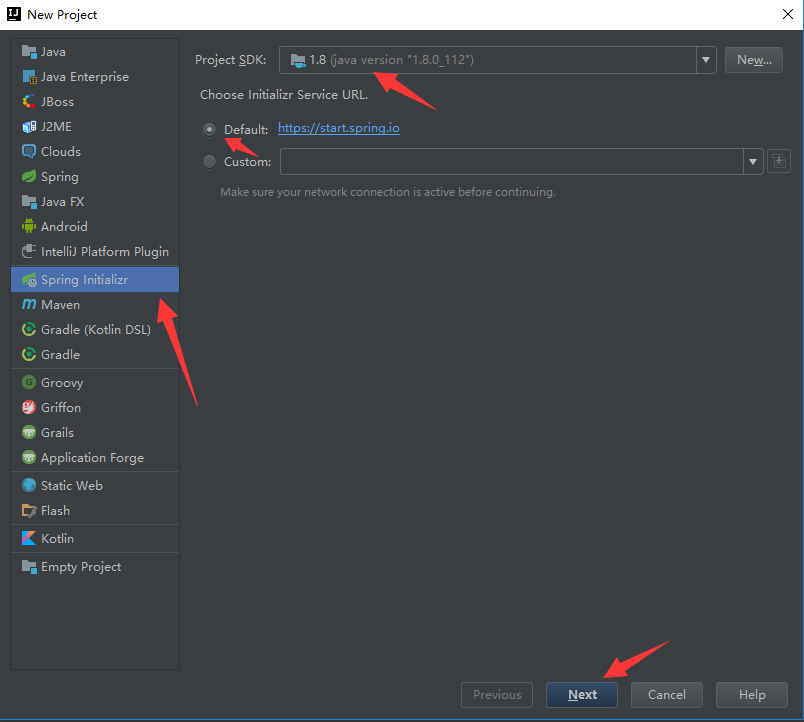
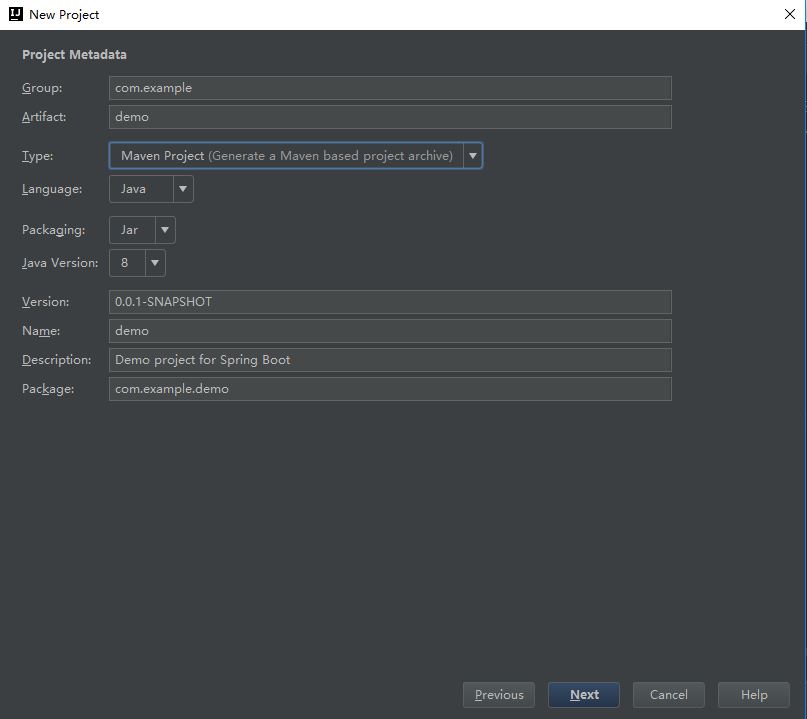
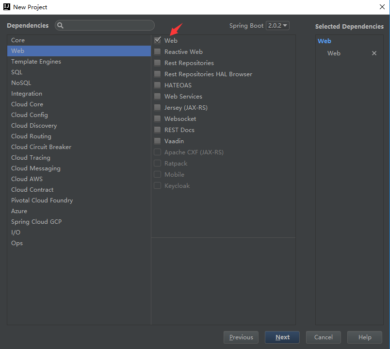
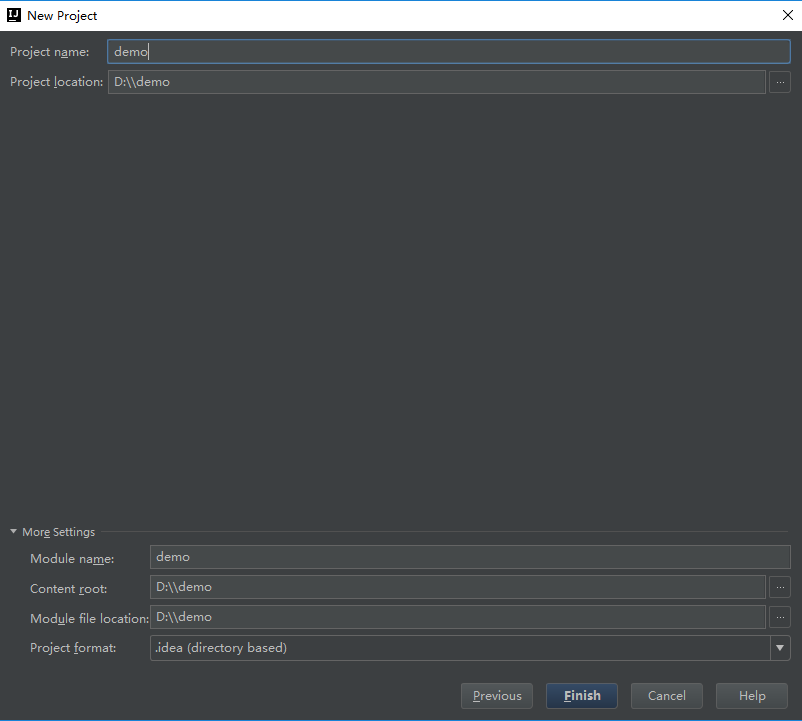
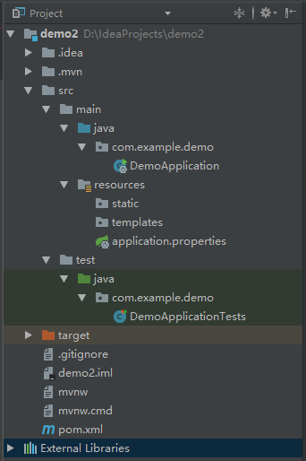
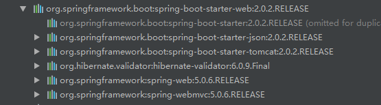
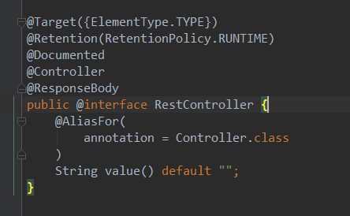

## 前言

    springboot一直以提高开发效率著称，自己也想学习一下，截止现在已经发布到2.0.2版本。网上大部分教程都是1.X的版本，但人要向前看不是吗？所以，我自己学习的过程中使用的是2.0版本。我把自己在网上看到1.X版本代码，在练习demo时遇到的问题也会记录，如果对你也有帮助那就再好不过了。
## 正文
    如果你对Spring Boot 还不熟悉，想了解Spring Boot 能做什么，有什么优缺点我想下面这个链接可以对你有很大的帮助。
    [官网地址](https://github.com/spring-projects/spring-boot)
### 使用环境

 - JDK 8(2.0版本必须使用Java 8以上版本)
 - Spring Boot 2.0.1 
 - IntelliJ IDEA 2017.3 (强烈推荐使用Idea开发Spring Boot项目)


### Hello World 

#### Maven构建项目

 1. 在File菜单里面选择 New > Project,然后选择Spring Initializr,然后如下图所示即可
 
 
 
 
 
 2. 构建完成后，目录结构如下图所示
 
至此项目已经构建完成了。
####  目录结构
 -src/maim/java 存放Java代码及入口文件
 -src/main/resources  存放静态文件、前端代码、配置文件
 -src/test 存放测试代码

这是基本的目录结构，当然实际开发中java目录下还是按照dao、service、controller、po、util等结构配置。springboot只是提供了基础的默认结构，完全可以自己定制。


----------


#### 运行项目

1.Pom.xml中引入Web模块，因为我在创建的时候的第三步勾上了Web的依赖，所以不需要引入，如果没有勾选则可以在Pom.xml中引入如下代码：

``` xml
        <dependency>
            <groupId>org.springframework.boot</groupId>
            <artifactId>spring-boot-starter-web</artifactId>
        </dependency>
```

Spring Boot提供了很多“开箱即用”的依赖模块，可以打开Pom.xml文件查看，比如spring-boot-starter-parent是一个特殊的starter,它用来提供相关的Maven默认依赖，使用它后常用的包依赖可以省去version标签。需要查看它有哪些默认依赖可以在目录查看C:\Users\用户名\.m2\repository\org\springframework\boot\spring-boot-dependencies\2.0.2.RELEASE\spring-boot-dependencies-2.0.2.RELEASE.pom。

引入了web模块后，可以查看它依赖了哪些其他的模块，如下图：


查看这个些模块引入的依赖就会发现，Spring Boot对Spring的配置进行了打包而已引入，其实还是使用Spring 的环境。只是这些不用开发者操心了，更加关注自己的业务代码。

2.编写Controller代码

在DemoApplication 入口类中添加**@RestController**注解和index方法：

``` java
@RestController
@SpringBootApplication
public class DemoApplication {

	@RequestMapping("/hello")
	public String index() {
		return "Hello World";
	}

	public static void main(String[] args) {
		SpringApplication.run(DemoApplication.class, args);
	}
}
```
@RestController 注解可以点进入看，它其实是很多注解的集合：


3.在DemoApplication 类中右键启动，就和启动普通的main方法一样，然后浏览器访问http://localhost:8080/hello 就可以看到结果了。


## 感谢
[纯洁的微笑](http://www.ityouknow.com/springboot/2016/01/06/spring-boot-quick-start.html)
[嘟嘟独立博客](http://tengj.top/2017/02/26/springboot1/)


作者：狂奔的熊二

出处：www.xiamo.club
